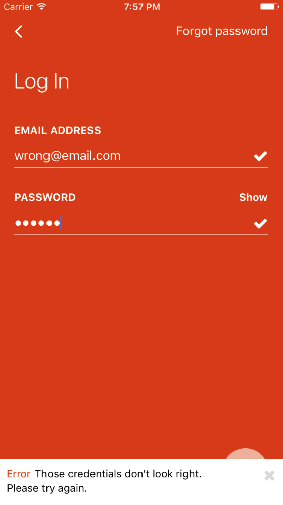
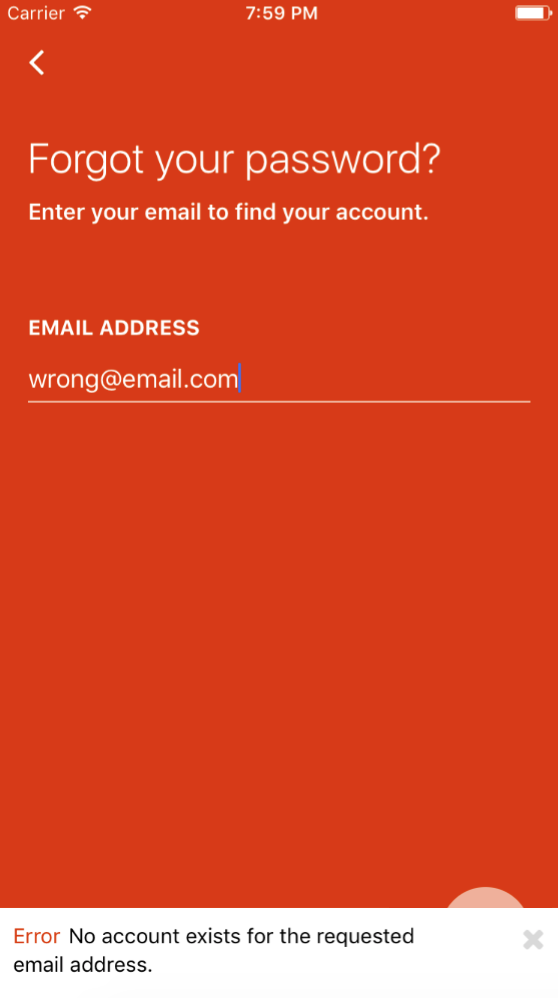
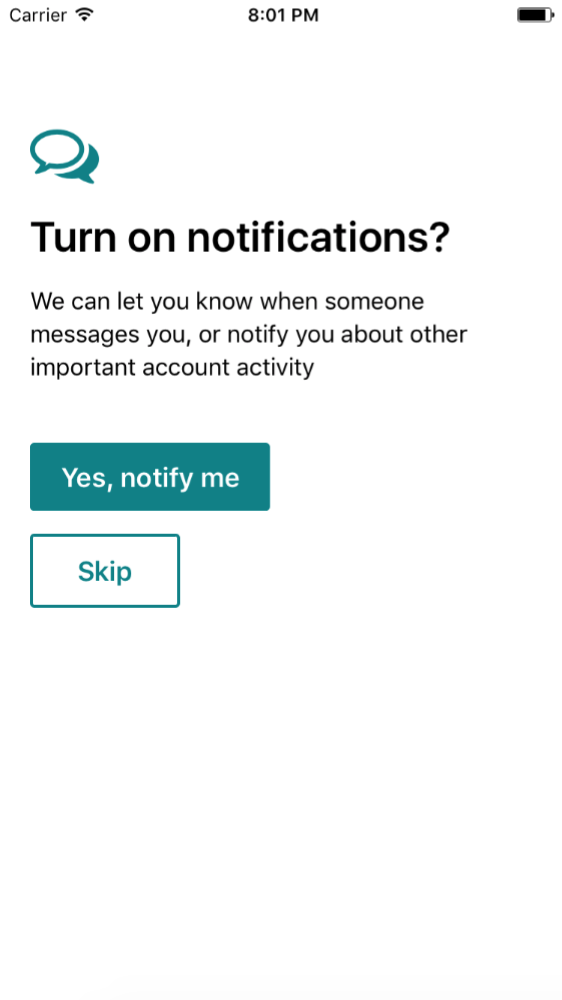
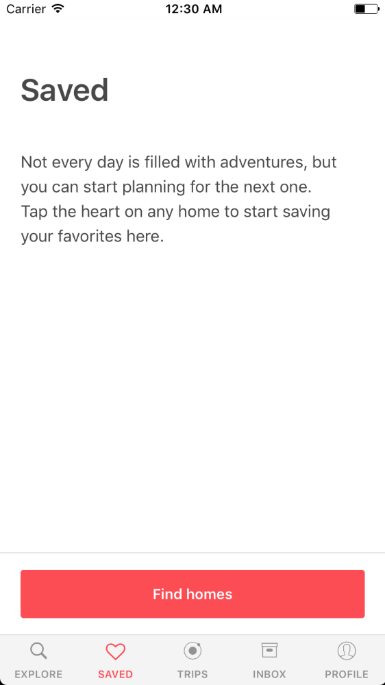

# react-native-FairFly
FairFly mobile app using React Native & Redux

<table>
  <tr>

    <td></td>
    <td></td>
  <tr>
  <tr>

    <td></td>
    <td></td>
  <tr>

</table>

## How to use
- Clone
- Run `npm install` in the terminal
- Run on IOS or Android projects in emulator

## Login details
- email: Adm@adm.com
- password: 12345

